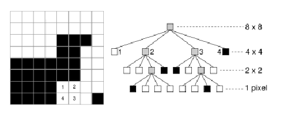
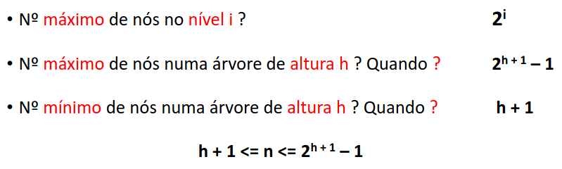
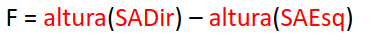

# Árvores Binárias

As árvores binárias são estruturas de dados que são compostas por arcos/arestas e nós, onde as arestas são a conexão entre dois nós indicando uma relação hierárquica, por exemplo a árvore geneológica.
A ordem de um nó é ditada pela quantidade de filhos que ele apresenta. A ordem da árvore é a ordem do nó com mais filhos.

Todas as árvores são grafos mas nem todos o grafos são árvores.
Nem todos os gráficos são árvores porque os gráficos não repeitam uma restrição de conectividade nem de aciclicidade, em resumo uma árvore é um tipo de grafo com propriedades particulares.

Para calcular o número de nós de uma árvore basta retirar ao número de arcos uma unidade. Para além disso também podemos afirmar que apenas existe um caminho entre qualquer par de nós distintos. 

## Árvores Orientadas

Respeitando a afirmação dita acima podemos de novo afirmar que todas as árvores orientadas são grafos mas nem todos os grafos orientados são árvores. 

Numa árvore orientada o nó raiz não tem qualquer arco incidente e cada um dos outros nós apenas tem um nó incidente, para além disso apenas existe um caminho entre a raiz e cada um dos outro nós.

## Árvores Quaternárias

As árvores quaternárias são utilizadas muitas vezes para representar imagens binárias, que apenas apresentam pixeis pretos ou brancos. 
A árvore neste exemplo começa por um nó que é cinza porque a região da imagem que este nó representa é composta por pixeis pretos e pixeis brancos. de seguida a árvores vai se subdividir recursivamente até representar todos os pixeis da imagem. 

## Árvores Octais

A árvores octais são utilizadas muitas vezes para representar volume, por exemplo de um cubo, o primeiro nó da árvore representa o cubo todo, depois esse nó subdivide-se em 8 nós que vão representar 8 partes iguais do cubo que depois se irão subdividir denovo em 8 recursivamente.

## Em suma

O grau de um nó representa todas as suas subárvores não-vazias, o grua da árvore refere-se ao maior grau entre todos os nós da árvore, um nó não terminal são aqueles que têm pelo menos um filho e representam pontos de decisão dentro da árvore, as folhas são nós sem filhos.

O pai,filhos,irmão é exatamente a mesma lógica que numa árvore geneológica, o nó acima de outro é o pai, o nó abaixo é o filho e os irmão são os nós que compartilham o mesmo pai.

Os antepassados são todos os nós ao longo do caminho entre a raiz e esse nó inclusive a raiz e o próprio nó, os descendentes são todos os nós que podem ser alcançados a partir desse nó seguindo links para baixo até ás folhas.

O nivel da raiz é o nivel 0 os outro nós é apenas incrementar um desde a raiz.

A altura de uma árvore pode ser obtida atravessando as arestas desde a raiz até as folhas, e de sguida o maior valor de arestas é a altura da árvore, se o nivel da raiz for 0 o indice do último nivel é a altura da árvore.

## Representação de expressões

Para representar uma expressão temos 3 notações conhecidas, INFIXA, PREFIXA E POSFIXA.

A notação INFIXA é a forma mais comum e usual de escrever expressões, em que o operador é colocado entre os operandos por exemplo (A+B). REquer parenteses para indicar a ordem 

A notação PREFIXA o operador é colocado antes dos seus operandos (+AB). Não requer uso de parenteses pois a ordem das operações é definida pela ordem dos operadores e operandos.

A notação POSFIXA o operador é colocado depois dos seus operando (AB+), assim como acontece na notação PREFIXA a ordem das operações é ditada pela posição dos operadores e operandos então parenteses não são necessários.

## Travessias

Para representarmos a expressão numa árvore colocamos nas folhas os operandos nos nós não terminais os operadores, para depois obtermos a expressão temos que fazer a travessia da árvore mas existem várias maneiras de a fazer, travessia em pré-ordem(NLR), travessia em ordem (LNR) e travessia em pós-ordem(LRN).

Em pré-ordem (NLR-Node,Left,Right), a travessia consiste em visitar primeiro a a raiz e depois a subárvore esquerda e por fim a sub-árvore da direita.

Em ordem visita primeiro a sub-árvore da esquerda depois a raiz e apenas depois a sub-árvore da direita.

Em pós-ordem visita primeiro a sub-árvore da esquerda depois a da direita e por fim a raiz.

### Travessias recursivas

Mesma lógica explicada acima.

### Travessias iterativas por niveis

Breadth-First traversal, são visitados todos os nós de um nivel da esquerda para a direita até que não hajam mais nós e depois passa-se para o nivel abaixo começando no nó mais á esquerda até ao nó mais á direita. A solução habitual é usar uma fila o nó raiz é colocado na fila enquanto a fila não estiver vazia o nó na frente da fila é removido e os seus filhos são visitados, isto acontece até que a fila esteja vazia.

## Árvores equilibradas

Em árvores de busca binária, para operações como inserção busca e remoção têm eficiência dependedo do comprimento da raiz até ao nó. Idealmente, esse comprimento é pequeno.

Se uma árvore binária de pesquisa se tornar muito desequilibrada, ou seja com uma altura exagerada, as operações mencionada acima podem se aproximar da eficiência de uma lista ligada, ou seja O(n)no pior caso , sendo n o numero de elementos da árvores mas para operações eficientes é bom que a árvore tenha uma altura proporcional a O(log n), que indica que a árvore é relativamente equilibrada.

Para manter a árvore equilibrada são necessárias certas estratégias que asseguram que a altura das subárvores de qualquer nó não seja muito diferente, árvore balanceada.

### Critério de Equilibrio

As árvores equilibradas para se manterem equilibradas utilizam um conjunto de regras e operações, tais como, rotações para assegurar que após inserções e remoções a árvore se reorganiza para manter a condição de equilibrio, implica que a altura de duas sub-árvores não diferencie mais do que uma unidade.

O fator de equilibrio de um nó obtém com a seguinte expressão:

